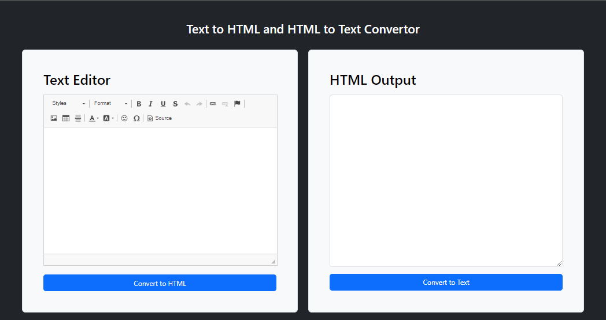

# Django Text to HTML Convertor

## Overview

This Django application converts plain text to HTML using Django's template system. It provides a simple interface to input text and get the corresponding HTML output

## Features

- Text to HTML Convertor
- HTML to Text Convertor

## Prerequisites

Make sure you have the Python installed:

- Python (version 3.x recommended)

## Note:

In the command line, type `python`. If Python is installed, you should see a message like “Python 3.x.x” followed by the Python prompt, which looks like this “>>>”. Note that “3.x.x” represents the version number of Python

```bash
python
# OR
python --version
```

# Demo:

## Homepage



**1.Clone the Repo**

```sh
git clone https://github.com/Kaiyrtay/Django-TextToHTML.git
cd Django-TextToHTML
```

**2.Install Requirements**

```sh
pip install -r requirements.txt
```

**3.Create .env**

```sh
cd ~/Django-TextToHTML/base
touch .env
```

At your .env file:

```bash
DEBUG=True/False

SECRET_KEY=<your_value>
```

**4.Apply migrations:**

```bash
python manage.py migrate
```

**5.Create a superuser (admin):**

```bash
python manage.py createsuperuser
```

**6.Start the development server:**

```bash
python manage.py runserver
```

# End

> Good luck.
